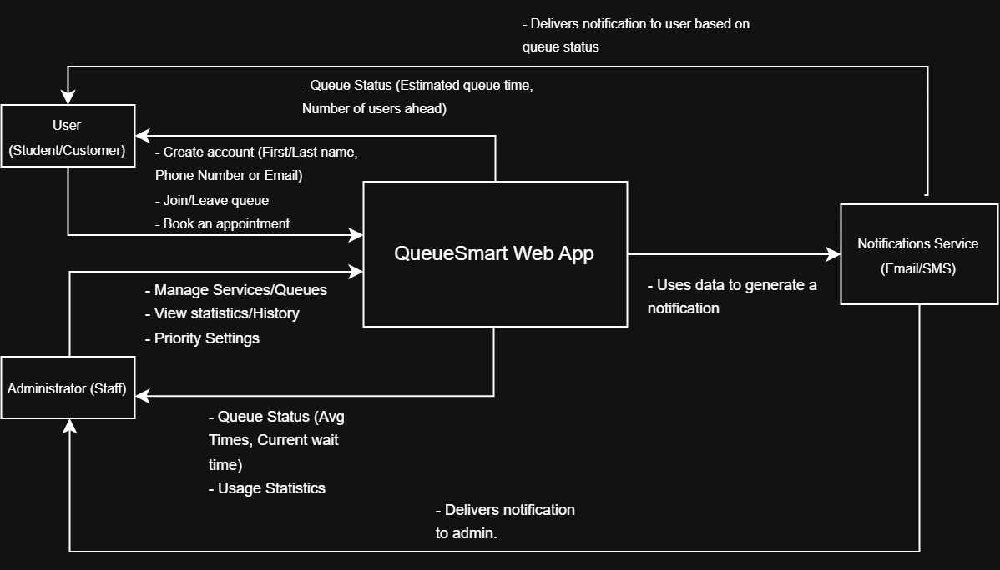

# Assignment 1: Initial Thoughts and System Design
## QueueSmart – Smart Queue Management Application

---

## 1. Initial Thoughts

The main users of QueueSmart are regular users and administrators. Regular users may include students, patients, customers, or anyone waiting to receive a service. Administrators are the staff members responsible for creating services, managing queues, and monitoring the overall system.

In order to create an account, users will need to provide their first and last name, email address and a password, confirming it through a verification email before being able to use the account; same email will then be used for notification purposes. Once logged in, a user can join a queue through a link or QR code generated by the administrator for that specific service, and manage their participation — joining or leaving — directly from their dashboard. The users will be able to see their current position, make informed estimates of waiting time, and monitor their queue status directly from the dashboard.

Administrators will register for their own account, giving them access to a separate admin dashboard. From there, they create a service by defining its name and description, its expected duration, and a priority level (low, medium, or high) — this priority is set at the service level rather than per individual user, keeping the system simple and predictable (e.g., "Walk-in Emergencies" is always high priority, "General Inquiries" is always low). Once a service is live, administrators can monitor all active queues in real time, manually adjust or remove entries if needed (such as a no-show), and review historical data and usage statistics — comparing actual wait times against their original estimates to refine future service durations.

The most important features are user authentication, queue management, estimated wait times, priority-based ordering, notifications, service management, and queue history. These features matter because they give users clear visibility into what to expect, while giving administrators the flexibility to tailor each service to its own needs rather than forcing everything into a standardized format. Reviewing queue history is especially valuable here — it lets administrators compare real-world wait times against their original estimates, providing a more realistic basis for future duration settings than a fixed guess.

One of the main challenges will be providing accurate wait-time estimates, since actual service times may be shorter or longer than expected. Another challenge will be handling long queues and priority levels fairly while keeping users' queue positions updated. Notifications will also need to be timely and reliable so users do not miss their turn. The system should also be designed so that multiple users can join, leave, or change queue positions without causing inconsistent information.

---

## 2. Development Methodology

Our team will follow the Scrum framework based on Agile development methodology. Agile is basically the mindset behind how we want to work — staying flexible, building things in small pieces, and adjusting as we go instead of trying to plan everything perfectly at the start. Scrum is how we're actually going to do that throughout the semester as we'll break our work into short sprints (around a couple weeks each), keep a backlog of tasks we need to get done, and check in with each other regularly to see how things are going.

We think this approach makes sense for a few reasons. First, QueueSmart is made up of several smaller pieces like login/authentication, service management, the actual queueing logic, notifications, and history tracking. That kind of project fits well with Agile because we can work on pieces one at a time instead of trying to build the whole thing at once. Second, since this class has us building the project across multiple assignments (A1 through A4, then the final demo), it already feels like we're working in sprints whether we plan it that way or not. Each assignment is basically a checkpoint where we show what we've built and get feedback. Third, and this is something we already ran into while working on our Initial Thoughts section, some of our biggest challenges (like getting wait-time estimates right) aren't things we can just figure out on paper. They depend on actual usage and data, so our plan is to build a basic version early, see how it performs, and improve it over time instead of trying to nail it perfectly on the first try. Lastly, since we're a small team, Scrum works well because it doesn't require a ton of overhead, long documents or complicated processes, just short check-ins and a simple task list.

As far as how this helps us across the semester, we're planning to treat each assignment like the end of a sprint, where we stop, look at what we've built, and get feedback before moving on to the next piece. And since Agile is all about adapting, if we go back and realize something we decided in A1 doesn't quite work once we're deeper into A2 or A3, we can go back and adjust it instead of being stuck with our original choice. It also makes contribution on GitHub easy for us since every sprint's work can be easily aligned with the assignments, thus making it easy for us to document individual contributions.

---

## 3. High-Level Design / Architecture

### System Context Diagram

### How the major components interact

QueueSmart is designed as a single web application with two external actors — the **User** and the **Administrator** — and one external system it depends on, a **Notifications Service** (email/SMS).

A **User** creates an account with their name and phone number or email, then joins or leaves a queue and can book an appointment directly through the web app. In return, QueueSmart sends the user their queue status — estimated wait time and number of users ahead — so they always know where they stand.

An **Administrator** uses the same web app to manage services and queues, view usage statistics and history, and configure priority settings for each service. QueueSmart sends back queue status relevant to staff — average service times, current wait time, and usage statistics — so administrators can monitor how services are performing.

Whenever a user's queue status changes in a way that matters (their turn is approaching, or a status update occurs), QueueSmart passes that information to the external **Notifications Service**, which uses the data to generate and deliver the actual notification — either to the user (e.g., "you're next") or to the administrator (e.g., a queue backlog alert). QueueSmart itself doesn't handle message delivery — it only decides when a notification is needed and hands that off externally.

This keeps the diagram focused purely on system boundaries: what's inside QueueSmart, what's outside it (the Notifications Service), and how the two human actors interact with the system — without describing any internal implementation details.

---

## Team Contribution

| Group Member Name | Contribution |
|---|---|
| Agah Duzenli | Initial Thoughts, Architecture |
| Dang Nguyen | Development Methodology |
| Derek F Lihou | High-Level Design / Architecture |
| Skyler Tran | |